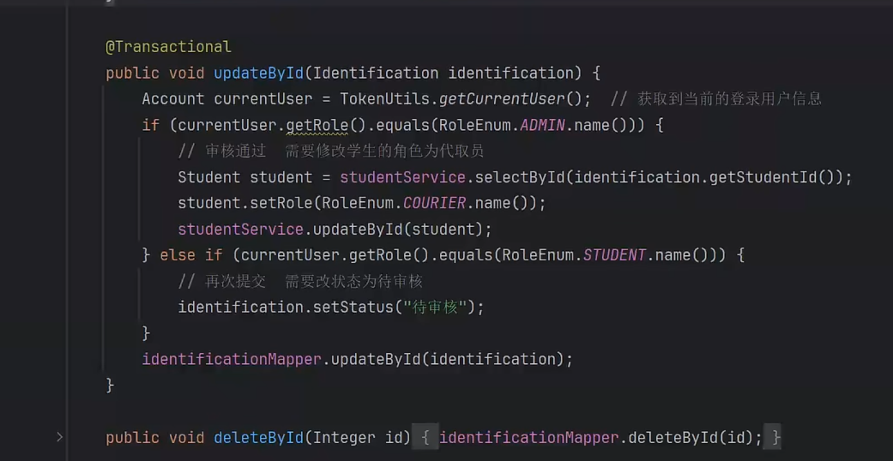

## 进度

### Init Datebase

---

sql初始化表

~~~sql
-- 管理员信息表
CREATE TABLE `admin` (
    `id` INT AUTO_INCREMENT PRIMARY KEY COMMENT '管理员ID',
    `username` VARCHAR(255) NOT NULL COMMENT '用户名',
    `password` VARCHAR(255) NOT NULL COMMENT '密码',
    `name` VARCHAR(255) COMMENT '姓名',
    `avatar` VARCHAR(255) COMMENT '头像链接',
    `role` VARCHAR(255) COMMENT '角色',
    `phone` VARCHAR(255) COMMENT '电话号码',
    `email` VARCHAR(255) COMMENT '电子邮箱',
    `created_at` DATETIME COMMENT '创建时间',
    `updated_at` DATETIME COMMENT '更新时间'
) ENGINE=InnoDB DEFAULT CHARSET=utf8mb4 COMMENT='管理员信息表';

-- 提现记录/提现申请表
CREATE TABLE `cash_record` (
    `id` INT AUTO_INCREMENT PRIMARY KEY COMMENT '记录ID',
    `courier_id` INT COMMENT '代取员ID（指向student表的id）',
    `amount` DECIMAL(10,2) COMMENT '提现金额',
    `status` VARCHAR(50) COMMENT '状态（待审核/已通过/已拒绝）',
    `admin_id` INT COMMENT '审核管理员ID',
    `created_at` DATETIME COMMENT '申请时间',
    `updated_at` DATETIME COMMENT '更新时间（审核时间）'
) ENGINE=InnoDB DEFAULT CHARSET=utf8mb4 COMMENT='提现记录/提现申请表';

-- 代取员等级信息表
CREATE TABLE `courier_commission` (
    `id` INT AUTO_INCREMENT PRIMARY KEY COMMENT '等级ID',
    `courier_level` INT COMMENT '代取员等级（例如1、2、3）',
    `commission_rate` DECIMAL(5,2) COMMENT '提现比例（百分比，例如0.7表示70%）',
    `created_at` DATETIME COMMENT '创建时间',
    `updated_at` DATETIME COMMENT '更新时间'
) ENGINE=InnoDB DEFAULT CHARSET=utf8mb4 COMMENT='代取员等级信息表';

-- 代取快递分类表
CREATE TABLE `express_type` (
    `id` INT AUTO_INCREMENT PRIMARY KEY COMMENT '分类ID',
    `type_name` VARCHAR(255) COMMENT '分类名称（例如普通快递/加急快递）',
    `price` DECIMAL(10,2) COMMENT '分类价格',
    `description` TEXT COMMENT '分类描述',
    `created_at` DATETIME COMMENT '创建时间',
    `updated_at` DATETIME COMMENT '更新时间'
) ENGINE=InnoDB DEFAULT CHARSET=utf8mb4 COMMENT='代取快递分类表';

-- 反馈信息表
CREATE TABLE `feedback` (
    `id` INT AUTO_INCREMENT PRIMARY KEY COMMENT '反馈ID',
    `user_id` INT COMMENT '用户ID（指向student表的id）',
    `user_type` VARCHAR(50) COMMENT '用户类型（student/courier）',
    `content` TEXT COMMENT '反馈内容',
    `status` VARCHAR(50) COMMENT '状态（待处理/已解决）',
    `created_at` DATETIME COMMENT '提交时间',
    `updated_at` DATETIME COMMENT '更新时间（处理时间）'
) ENGINE=InnoDB DEFAULT CHARSET=utf8mb4 COMMENT='反馈信息表';

-- 代取员认证申请表
CREATE TABLE `identification` (
    `id` INT AUTO_INCREMENT PRIMARY KEY COMMENT '申请ID',
    `student_id` INT COMMENT '学生ID（指向student表的id）',
    `status` VARCHAR(50) COMMENT '状态（待审核/已通过/已拒绝）',
    `admin_id` INT COMMENT '审核管理员ID',
    `created_at` DATETIME COMMENT '申请时间',
    `updated_at` DATETIME COMMENT '更新时间（审核时间）'
) ENGINE=InnoDB DEFAULT CHARSET=utf8mb4 COMMENT='代取员认证申请表';

-- 校园资讯/公告信息表
CREATE TABLE `information` (
    `id` INT AUTO_INCREMENT PRIMARY KEY COMMENT '资讯ID',
    `title` VARCHAR(255) COMMENT '标题',
    `content` TEXT COMMENT '内容',
    `type` VARCHAR(50) COMMENT '类型（资讯/公告）',
    `created_at` DATETIME COMMENT '创建时间',
    `updated_at` DATETIME COMMENT '更新时间'
) ENGINE=InnoDB DEFAULT CHARSET=utf8mb4 COMMENT='校园资讯/公告信息表';

-- 公告信息表（information的别名）
CREATE TABLE `notice` (
    `id` INT AUTO_INCREMENT PRIMARY KEY COMMENT '资讯ID',
    `title` VARCHAR(255) COMMENT '标题',
    `content` TEXT COMMENT '内容',
    `type` VARCHAR(50) COMMENT '类型（资讯/公告）',
    `created_at` DATETIME COMMENT '创建时间',
    `updated_at` DATETIME COMMENT '更新时间'
) ENGINE=InnoDB DEFAULT CHARSET=utf8mb4 COMMENT='公告信息表';

-- 代取订单信息表
CREATE TABLE `orders` (
    `id` INT AUTO_INCREMENT PRIMARY KEY COMMENT '订单ID',
    `student_id` INT COMMENT '学生ID（指向student表的id）',
    `courier_id` INT COMMENT '代取员ID（指向student表的id，可为空）',
    `type_id` INT COMMENT '代取类型ID（关联express_type）',
    `status` VARCHAR(50) COMMENT '状态（待接单/已接单/派送中/已完成）',
    `address_id` INT COMMENT '地址ID',
    `created_at` DATETIME COMMENT '创建时间',
    `updated_at` DATETIME COMMENT '更新时间'
) ENGINE=InnoDB DEFAULT CHARSET=utf8mb4 COMMENT='代取订单信息表';

-- 代取员解封申请表
CREATE TABLE `release_apply` (
    `id` INT AUTO_INCREMENT PRIMARY KEY COMMENT '申请ID',
    `courier_id` INT COMMENT '代取员ID（指向student表的id）',
    `reason` TEXT COMMENT '解封原因',
    `status` VARCHAR(50) COMMENT '状态（待审核/已通过/已拒绝）',
    `admin_id` INT COMMENT '审核管理员ID',
    `created_at` DATETIME COMMENT '申请时间',
    `updated_at` DATETIME COMMENT '更新时间（审核时间）'
) ENGINE=InnoDB DEFAULT CHARSET=utf8mb4 COMMENT='代取员解封申请表';

-- 代取员提升等级申请表
CREATE TABLE `upgrade_apply` (
    `id` INT AUTO_INCREMENT PRIMARY KEY COMMENT '申请ID',
    `courier_id` INT COMMENT '代取员ID（指向student表的id）',
    `current_level` INT COMMENT '当前等级',
    `target_level` INT COMMENT '目标等级',
    `status` VARCHAR(50) COMMENT '状态（待审核/已通过/已拒绝）',
    `admin_id` INT COMMENT '审核管理员ID',
    `created_at` DATETIME COMMENT '申请时间',
    `updated_at` DATETIME COMMENT '更新时间（审核时间）'
) ENGINE=InnoDB DEFAULT CHARSET=utf8mb4 COMMENT='代取员提升等级申请表';

-- 学生信息表（包含代取员信息）
CREATE TABLE `student` (
    `id` INT AUTO_INCREMENT PRIMARY KEY COMMENT '学生ID',
    `username` VARCHAR(255) NOT NULL COMMENT '用户名',
    `password` VARCHAR(255) NOT NULL COMMENT '密码',
    `name` VARCHAR(255) COMMENT '姓名',
    `avatar` VARCHAR(255) COMMENT '头像链接',
    `phone` VARCHAR(255) COMMENT '电话号码',
    `email` VARCHAR(255) COMMENT '电子邮箱',
    `role` VARCHAR(50) COMMENT '角色（student/courier）',
    `level` INT COMMENT '代取员等级（例如1、2、3，仅对代取员有效）',
    `rating` DECIMAL(3,1) COMMENT '平均评分（基于订单，仅对代取员有效）',
    `order_count` INT COMMENT '接单数量（用于排行榜，仅对代取员有效）',
    `created_at` DATETIME COMMENT '注册时间',
    `updated_at` DATETIME COMMENT '更新时间'
) ENGINE=InnoDB DEFAULT CHARSET=utf8mb4 COMMENT='学生信息表（包含代取员信息）';

-- 用户地址信息表
CREATE TABLE `address` (
    `id` INT AUTO_INCREMENT PRIMARY KEY COMMENT '地址ID',
    `user_id` INT COMMENT '用户ID（指向student表的id）',
    `user_type` VARCHAR(50) COMMENT '用户类型（student/courier）',
    `address` VARCHAR(255) COMMENT '详细地址',
    `created_at` DATETIME COMMENT '创建时间',
    `updated_at` DATETIME COMMENT '更新时间'
) ENGINE=InnoDB DEFAULT CHARSET=utf8mb4 COMMENT='用户地址信息表';
~~~

### Login

---

form.value属性大写 ：

role:   ADMIN ；STU ； COUR(代取员)

==通过role字段判断跳转到哪个首页==

/register页面还没有实现

后端端口：9091

前段端口：8081

前段===和=区别

前段只调用一个controller层的/login接口

后端controller从service层中再分别调用Admin和Student的个自的login接口

controller层中用Account基类来接收前端传送过来的username和password字段 (**多态思想**)

### Register

---

注册时候设置role为student。

### Person

个人信息修改

父组件和子组件的user数据保持一致

~~~vue
父组件 
<RouterView @updateUser="updateUser"/>

const updateUser = () => {
  data.user = JSON.parse(localStorage.getItem('user'));
};

子组件里面
// 声明 emit 事件
const emit = defineEmits(['updateUser']);
emit('updateUser'); // 触发事件
~~~

### StuHome and AdminHome

---

/student/home为前段

/admin/home为后端

### ExpressType

---

数据库表字段context类型，用String类型

ExpressType

add

update

/deleteById

/deleteBatch 

/selectById/{id}

/selectAll

/selectPage

7个数据库操作

**Mapper.xml，Mapper.java**

1. 凡是设计数据库表，表名采用下划线， 

2. 查询条件
3. insert 和update语句重写

在发送get请求查询时候，前面的typeName要和

### Student

---

1. entity -> controller -> service -> mapper -> sql
2. 用了`<el-image>`标签中的`preview-src-list`属性开启了头像的预览功能

==完善Student表的LocalDateTime类型字段==

### Admin的信息

 先简单完成对admin表的后端的增删改查内容，后续再美化

### Express_commission

---

`<el-input-number>`设置精度和placeholder

### Identification

用/files/uploadStuCard专门放置student id card图片，与普通图片做区分

后端identification的审核部分和前端提交identification页面的load,上传部分比较复杂

### Courier

代取员也有学生这层身份

如果代取员的账号用学生身份登入时候，将localstorge中的user role属性改为STU

动态绑定禁用表单

### Orders

databasae add 

description varchar(255)

pickup_address varchar(255)

access_time 订单接收时间

delivery_time 订单送达时间

sign_time 订单签收时间

rate 评分

feedback 反馈信息

关联查询

多表查询属性

name,username,typeName,address,

自动生成的属性

status，4个time，

订单签收进行评分和反馈

==查询student/orders功能==

#### 5/3

开发完下单和管理员的订单页面，需要开发接单和地址薄功能

## 知识点

### 设置元素水平居中

#### Flex布局

<template>
  

    <el-card style="width: 50%;">
      <!-- 表单内容 -->
    </el-card>
  

</template>

#### margin

<el-card style="width: 50%; margin: 0 auto;"/>

index.js中的path中的name不能重复

<el-form-item>组件中prop属性用于规则验证

## 小问题

实体类的get方法名要与数据库中字段名对应，否则会识别不到

## 创新点

1. 加入ai